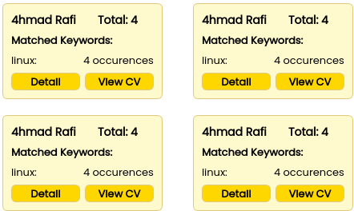

# <h1 align="center">Tugas Besar 3 IF2211 Strategi Algoritma</h1>
<h2 align="center">Semester II tahun 2024/2025</h2>
<h3 align="center">Pattern Matching on Digital CV-Based Applicant Tracking System (ATS)
</h3>

<p align="center">
  
</p>

## Table of Contents
- [Description](#description)
- [Algorithms](#algorithms-implemented)
- [Program Structure](#program-structure)
- [Requirements & Installation](#requirements--installation)
- [Author](#author)
- [Demo](#demo)

## Description
This program is a desktop-based Applicant Tracking System (ATS) designed to streamline the recruitment process. The application analyzes and filters candidates by processing their digital CVs in PDF format. It utilizes various pattern matching algorithms to identify relevant applicants based on keywords provided by the user. The system performs exact matching for core requirements and also incorporates fuzzy matching to account for typos or variations in terminology, ensuring no potential candidates are overlooked.

Furthermore, the application uses Regular Expressions to parse and extract structured information from the unstructured text of a CV, such as skills, work experience, and educational background, presenting a comprehensive summary to the user.

## Algorithms Implemented
### 1. Boyer-Moore & Knuth-Morris-Pratt (KMP)
These algorithms are the core of the exact matching feature. When a user searches for specific keywords (e.g., "Python", "Project Manager"), the system employs either KMP or Boyer-Moore to rapidly scan the entire text content of each CV. They are highly efficient for finding precise string occurrences within large documents, serving as the primary filter for essential qualifications.

### 2. Levenshtein Distance
This algorithm powers the fuzzy matching capability. If an exact match for a keyword is not found, the system uses the Levenshtein Distance to calculate the similarity between the keyword and words within the CVs. This is crucial for handling common issues like spelling mistakes (e.g., "Pythen" instead of "Python") or minor variations in terms, ensuring that relevant candidates are not missed due to small errors.

### 3. Reguler Expressions (Regex)
Regex is used for information extraction. After a CV is processed, specific regex patterns are applied to identify and pull out structured data from the raw text. This includes summary, skills, experiences, and education.

This extracted information is then presented in a clean, easy-to-read summary page for each candidat

## Program Structure
```
.src
├── algorithms
│   ├── AhoCorasick.py
│   ├── BoyerMoore.py
│   ├── KnuthMorris.py
│   ├── Levenshtein.py
│   ├── ProfileEncyption.py
│   └── Regex.py
├── controller
│   ├── Controller.py
├── database
│   ├── db_config.py
│   ├── db_init.py
│   ├── db_insert.py
│   ├── db_search.py
│   ├── models.py
├── gui
│   ├── assets
│   │   └── Poppins-Regular.ttf
│   ├── components
│   │   ├── radio.py
│   │   ├── result_card.py
│   │   ├── result_view.py
│   │   ├── sidebar.py
│   │   └── switch.py
│   ├── main.py
│   ├── pages
│   │   ├── about_page.py
│   │   ├── analyze_page.py
│   │   ├── detail_page.py
│   │   ├── landing_page.py
│   │   ├── pdf_view.py
│   ├── Poppins
│   │   └── Poppins-Regular.ttf
├── main.py
├── requirements.txt
└── utils
    ├── normalize_pdf.py
```


## Requirements & Installation


1. Clone the Repositories

    ```bash
    git clone https://github.com/azfaradhi/Tubes3_aaaaa
    ```
2. Download the data
    Download the CV dataset to be used. Ensure the data folder is located in the project's root directory. Here is the [link](https://www.kaggle.com/datasets/snehaanbhawal/resume-dataset).

3. Database Setup

    First, create a new database named cv_ats in your MySQL server.

    Open the src/algorithms/ProfileEncryption.py file and adjust the database name, user, host, and password to match your configuration.

    Once configured, run the seeding script with the following command to set up the database attributes with encryption:

    ```bash
    python3 src/algorithms/ProfileEncryption.py
    ```
4. All setup is done and you can access the app by this command
    ```bash
    python3 -m src.gui.main
    ```    

## Author
| **NIM**  | **Nama Anggota**               | **Github** |
| -------- | ------------------------------ | ---------- |
| 13523095 | Rafif Farras              | [rafifrs](https://github.com/rafifrs) |
| 13523101 | Barru Adi Utomo           | [barruadi](https://github.com/barruadi) | 
| 13523115 | Azfa Radhiyya Hakim    | [azfaradhi](https://github.com/azfaradhi) |


## Demo
For demonstration, you can see it [here](https://youtu.be/CAKHyJiRgAY?feature=shared)